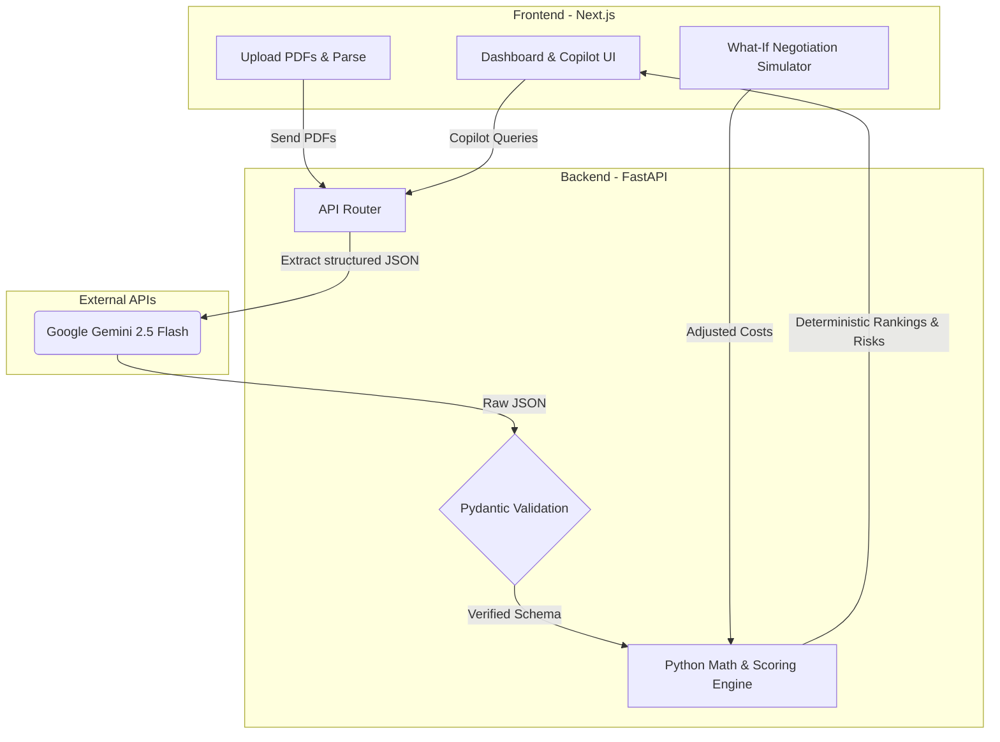

<div align="center">

  # ⚙️ ProcurePilot AI
  
  **Compare vendor quotes in seconds. Math, not hallucinations.**

  ### [🚀 Launch Live Demo](https://procure-pilot-ai-two.vercel.app/)
  <p><i>Click "🔥 Try Instant Demo" inside the app to instantly explore the full dashboard — no PDFs required.</i></p>
  
  [](https://nextjs.org/)
  [](https://fastapi.tiangolo.com/)
  [](https://deepmind.google/technologies/gemini/)
  [](https://developer.mozilla.org/en-US/docs/Web/CSS)
  [](https://vercel.com)
</div>

<br />

ProcurePilot AI is an enterprise-grade procurement intelligence platform that analyzes vendor quotations, scores suppliers with deterministic math, surfaces contract risks, and acts as a conversational negotiation copilot.

Built for modern B2B procurement, it solves the **biggest problem with standard LLM wrappers**: *AI is terrible at financial math*. ProcurePilot separates the architecture — using AI strictly for structured data extraction, while relying on a **pure Python deterministic engine** to score, rank, and calculate savings. **Zero hallucinations in your procurement math.**

---

## ✨ Features

### Core Intelligence
- 🔥 **Instant Demo Mode** — Click and instantly explore a pre-analyzed procurement dashboard with no setup.
- 📊 **Deterministic Scoring Engine** — Pure Python handles all scoring, side-by-side cost comparisons, and financial math. No LLM touches the numbers.
- 👁️ **Vision LLM Extraction** — Google Gemini 2.5 Flash reliably extracts structured tables and messy text from quotation PDFs.

### Risk & Analysis
- 🚨 **Contract Clause Risk Matrix** — Automatically flags and categorizes risks across Force Majeure, Liquidated Damages, Liability Caps, and IP clauses with severity scoring per vendor.
- 📈 **Vendor Comparison Matrix** — Side-by-side comparison of all vendors across every extracted metric, with the recommended vendor visually highlighted.
- ⚖️ **Configurable Weight Sliders** — Dynamically adjust the importance of Cost, Warranty, and Delivery to instantly see how rankings shift.
- 🎯 **Auto-Calibrated Weights** — The engine automatically detects high variance across vendors (e.g., large warranty differences) and auto-calibrates the default weights to surface the most decisive differentiators.

### Negotiation & Reporting
- 💰 **What-If Negotiation Simulator** — A dedicated Copilot widget lets you select any vendor from a dropdown, apply a percentage discount (e.g., −10%), and click "Simulate" to instantly recalculate the entire scoring matrix and see if that vendor overtakes the competition.
- 🤖 **Procurement Copilot** — A persistent AI sidebar to chat with your procurement data, draft negotiation strategies, and query vendor-specific details. Includes one-click Quick Actions like "Negotiate with [Vendor]" for instant leverage strategies.
- 📄 **Executive PDF Reports** — One-click branded PDF summaries for fast management review.

---

## 🎨 Design Philosophy

ProcurePilot follows a **Calm Analytics** design philosophy inspired by premium enterprise tools like Linear and Vercel:

- **Soft UI** — Subtle card elevation with `1px` borders and gentle shadows instead of heavy drop-shadows.
- **Deep Indigo Brand Accent** (`#4f46e5`) — A sharp, enterprise-grade primary color applied to interactive elements, buttons, and data highlights.
- **Progressive Disclosure** — Dense contract clauses are elegantly truncated with CSS line-clamping, revealing full legal text via native tooltips on hover.
- **Data Pills** — Confidence scores and risk indicators are displayed as solid, color-coded pills (emerald for high confidence, amber for medium, rose for low) instead of raw floating numbers.
- **Winner Column Highlighting** — The recommended vendor column is visually anchored with a soft emerald background across the entire data grid.

The entire UI is built with a **custom Vanilla CSS design system** — no utility frameworks. Every pixel is intentional.

---

## 🏗️ Architecture

Most AI apps pass PDFs to an LLM and ask: *"Who is the cheapest?"* This leads to hallucinated numbers and unreliable financial decisions. 

**ProcurePilot uses a Deterministic-First Architecture:**



1. **Extraction:** Gemini 2.5 Flash reads the messy PDFs and outputs strictly typed JSON.
   <details>
   <summary><strong>See the Extracted Schema (Proof of Structure)</strong></summary>

   ```json
   {
     "vendor_name": "Apex Industrial Motors",
     "total_cost": 2065000,
     "warranty_months": 36,
     "delivery_timeline_days": 10,
     "payment_terms": "Net 30",
     "contract_clauses": {
       "force_majeure": "...",
       "liquidated_damages": "...",
       "liability_cap": "...",
       "ip_ownership": "..."
     }
   }
   ```
   </details>
2. **Validation:** Pydantic ensures all expected fields (prices, warranties, terms, clauses) are present and correctly typed.
3. **Execution:** Pure Python calculates the actual scores, rankings, risk assessments, and savings opportunities.
4. **Simulation:** The What-If engine recalculates the entire scoring matrix in real-time when a user applies a negotiated discount.
5. **Advisory:** The Copilot answers questions grounded strictly on the deterministic results — never on raw LLM speculation.

---

## 💻 Tech Stack

| Layer | Technology | Purpose |
|-------|-----------|---------|
| **Frontend** | React, Next.js 14, TypeScript | Responsive Dashboard, Copilot Chat UI |
| **Styling** | Vanilla CSS (Custom Design System) | Calm Analytics UI, Data Pills, Progressive Disclosure |
| **Backend** | Python, FastAPI, Uvicorn | Async API, Deterministic Math & Scoring Engine |
| **AI / Vision** | Google Gemini 2.5 Flash | Multimodal PDF Extraction & Chat Copilot |
| **Data Validation** | Pydantic | Strict JSON schema enforcement with retry workflows |
| **Deployment** | Vercel (FE), Hugging Face Docker (BE) | Distributed microservices architecture |

---

## 🚀 Quick Start (Local Development)

**Prerequisites:** 
- Python 3.10+
- Node.js 18+

To run ProcurePilot locally, you will need two terminals running simultaneously (one for the frontend, one for the backend).

### 1. Start the Backend (FastAPI)
```bash
cd backend
# Create and activate a virtual environment
python -m venv venv
source venv/bin/activate  # On Windows use: venv\Scripts\activate

# Install dependencies
pip install -r requirements.txt

# Set your Gemini API Key
echo "GEMINI_API_KEY=your_google_ai_studio_key_here" > .env

# Run the server
uvicorn main:app --reload
```
*The backend will be live at `http://localhost:8000`*  
*Interactive API Documentation (Swagger UI) is automatically available at `http://localhost:8000/docs`*

### 2. Start the Frontend (Next.js)
```bash
cd frontend

# Install dependencies
npm install

# Connect frontend to local backend (or leave empty to use deployed backend)
echo "NEXT_PUBLIC_API_URL=http://localhost:8000/api" > .env.local

# Start the development server
npm run dev
```
*The frontend will be live at `http://localhost:3000`*

---

## 🧪 Testing

A real deterministic engine requires proof. We use `pytest` to strictly verify that our scoring mathematics are executed perfectly without LLM interference.

```bash
cd backend
pytest tests/
```

---

## 🌐 Deployment

ProcurePilot operates as a decoupled application:
- The **Frontend** is deployed to **Vercel** for lightning-fast global CDN delivery.
- The **Backend** is packaged via the root `Dockerfile` and deployed on **Hugging Face Docker Spaces**, utilizing their infrastructure for heavy AI/Python workloads.

> **Note on Cold Starts:** As the backend is hosted on a free Hugging Face tier, the initial spin-up may take ~15-30 seconds on the very first request. The Next.js frontend gracefully handles this with a visual *"Waking up analysis engine..."* state so you are never left guessing.

---

## 📁 Project Structure

```
ProcurePilot-AI/
├── frontend/               # Next.js 14 application
│   ├── src/app/            # Pages, global styles, layout
│   ├── src/components/     # Dashboard, Copilot, UI primitives
│   └── src/services/       # API client, types
├── backend/                # FastAPI server
│   ├── app/services/       # Extraction, scoring, copilot logic
│   ├── app/schemas/        # Pydantic schemas
│   └── tests/              # Pytest suite
├── Dockerfile              # HuggingFace Spaces deployment
└── README.md
```

---

<div align="center">
  <p><i>Built with ☕ and deterministic math.</i></p>
</div>
