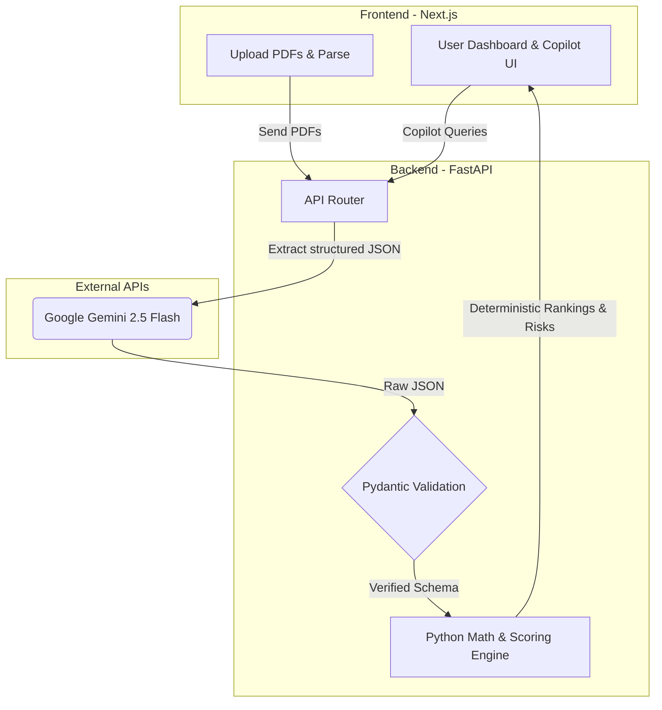

<div align="center">
  

  # ⚙️ ProcurePilot AI
  
  **Compare vendor quotes in seconds. Math, not hallucinations.**

  ### [🚀 Launch Live Demo (Instant Try)](https://procure-pilot-ai-two.vercel.app/)
  <p><i>(Judge Tip: Once in the app, click "🔥 Try Instant Demo" to bypass PDF extraction and instantly see the deterministic math in action).</i></p>
  
  [](https://nextjs.org/)
  [](https://fastapi.tiangolo.com/)
  [](https://deepmind.google/technologies/gemini/)
  [](https://vercel.com)
</div>

<br />

ProcurePilot AI is an enterprise-grade procurement assistant that analyzes vendor quotations, compares suppliers, identifies risks, and acts as a conversational negotiation copilot. 

Built for modern B2B procurement, it solves the **biggest problem with standard LLM wrappers**: *AI is terrible at financial math*. ProcurePilot separates the architecture—using AI strictly for structured data extraction, while relying on a pure Python deterministic engine to score, rank, and calculate savings. **Zero hallucinations in your procurement math.**

---

## ✨ Features

- 🔥 **Instant Demo Mode** — Click and instantly explore a pre-analyzed procurement dashboard.
- 📊 **Deterministic Scoring Engine** — Pure Python handles all scoring, side-by-side cost comparisons, and financial math.
- 👁️ **Vision LLM Extraction** — Google Gemini 2.5 Flash reliably extracts structured tables and messy text from quotation PDFs.
- 🚨 **Risk Detection** — Automatically flags short warranties, unusually long deliveries, and strict payment terms.
- 🤖 **Procurement Copilot** — Chat with your procurement data to draft negotiation emails and query vendor specifics.
- 📄 **Executive PDF Reports** — One-click branded PDF summaries for fast management review.

---

## 🏗️ Architecture

Most AI apps pass PDFs to an LLM and ask: *"Who is the cheapest?"* This leads to hallucinated numbers and unreliable financial decisions. 

**ProcurePilot uses a Deterministic-First Architecture:**



1. **Extraction:** Gemini 2.5 Flash reads the messy PDFs and outputs strictly typed JSON.
   <details>
   <summary><strong>See the Extracted Schema (Proof of Structure)</strong></summary>

   ```json
   {
     "vendor_name": "Apex Industrial Motors",
     "total_cost": 2065000,
     "warranty_months": 36,
     "delivery_timeline_days": 10,
     "payment_terms": "Net 30"
   }
   ```
   </details>
2. **Validation:** Pydantic ensures all expected fields (prices, warranties, terms) are present.
3. **Execution:** Pure Python calculates the actual scores, rankings, and savings opportunities.
4. **Advisory:** The Copilot only answers questions grounded on the deterministic results.

---

## 💻 Tech Stack

| Layer | Technology | Purpose |
|-------|-----------|---------|
| **Frontend** | React, Next.js, TypeScript, Tailwind | Glassmorphism UI, Responsive Dashboard |
| **Backend** | Python, FastAPI, Uvicorn | Async API, Deterministic Math Engine |
| **AI / Vision** | Google Gemini 2.5 Flash | Multimodal PDF Extraction & Chat Copilot |
| **Data Validation**| Pydantic | Strict JSON schema enforcement |
| **Deployment** | Vercel (FE), Hugging Face Docker (BE)| Highly-available distributed microservices |

---

## 🚀 Quick Start (Local Development)

**Prerequisites:** 
- Python 3.10+
- Node.js 18+

To run ProcurePilot locally, you will need two terminals running simultaneously (one for the frontend, one for the backend).

### 1. Start the Backend (FastAPI)
```bash
cd backend
# Create and activate a virtual environment
python -m venv venv
source venv/bin/activate  # On Windows use: venv\Scripts\activate

# Install dependencies
pip install -r requirements.txt

# Set your Gemini API Key
echo "GEMINI_API_KEY=your_google_ai_studio_key_here" > .env

# Run the server
uvicorn main:app --reload
```
*The backend will be live at `http://localhost:8000`*  
*Interactive API Documentation (Swagger UI) is automatically available at `http://localhost:8000/docs`*

### 2. Start the Frontend (Next.js)
```bash
cd frontend

# Install dependencies
npm install

# Connect frontend to local backend (or leave empty to use deployed backend)
echo "NEXT_PUBLIC_API_URL=http://localhost:8000/api" > .env.local

# Start the development server
npm run dev
```
*The frontend will be live at `http://localhost:3000`*

---

## 🧪 Testing (Enterprise-Grade Verification)

A real deterministic engine requires proof. We use `pytest` to strictly verify that our scoring mathematics are executed perfectly without LLM interference.

```bash
cd backend
pytest tests/
```

---

## 🌐 Deployment Structure

ProcurePilot operates as a decoupled application:
- The **Frontend** is deployed to **Vercel** for lightning-fast global CDN delivery.
- The **Backend** is packaged via the root `Dockerfile` and deployed on **Hugging Face Docker Spaces**, utilizing their robust infrastructure for heavy AI/Python workloads.

An `UptimeRobot` ping is configured against the `/api/health` endpoint to ensure the Hugging Face space is kept warm. 

> **Note on Cold Starts:** As the backend is hosted on a free Hugging Face tier for the hackathon, the initial spin-up may take ~15-30 seconds on the very first request if the platform is under heavy global load. Our Next.js frontend gracefully handles this with a visual *"Waking up analysis engine..."* state so you are never left guessing!

---

<div align="center">
  <p><i>Built for the Open Innovation Hackathon 2026</i></p>
</div>
